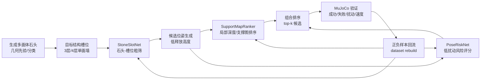

# 异步调度与神经策略替代阶段记录（2026-06-26）

## 目的

当前目标不是继续偶然冲高层数，而是围绕 3-4 层单面墙形成数据飞轮，逐步让神经网络替代启发式搜索的高开销部分。阶段目标分三层：

1. 稳定收集 3/4 层墙的正负样本，尤其是第 4 层中层和顶层的扰动失败样本。
2. 让网络先替代“石头-槽位筛选、候选姿态排序、低扰动风险判断”，保留结构槽位、低释放、底层支撑、底层连续性等物理先验。
3. 当 3/4 层网络策略成功率稳定提升后，再进入 5 层和更高层。否则高层成功只是偶然搜索结果，科学价值较低。

## 当前数据量

本次重新按 `run_name` 去重，生成了合并训练数据集：

`D:\MoonStack\experiments\moon_rock_stack\batch_runs\20260626_policy_replacement_dataset_v1`

去重后数据规模：

| 项目 | 数量 |
|---|---:|
| run 数 | 44 |
| run_examples | 127 |
| placement_examples | 2,515 |
| candidate_pose_examples | 141,988 |
| assignment_candidate_examples | 28,075 |
| 月球重力 placement | 1,756 |
| 月球重力成功 placement | 1,103 |
| 地球重力 placement | 759 |
| 地球重力成功 placement | 425 |

按角色汇总：

| 角色 | 样本 | 成功 | 失败 | 跳过 | 结论 |
|---|---:|---:|---:|---:|---|
| base | 829 | 707 | 40 | 82 | 底层已经相对稳定，底层支撑先验有效 |
| middle | 1,111 | 565 | 315 | 231 | 4 层墙瓶颈之一，扰动大、对准和支撑都困难 |
| cap | 575 | 256 | 165 | 154 | 4 层墙瓶颈之一，容易扰动已堆结构 |

4 层月面墙的关键瓶颈：

| 目标/角色/重力 | examples | committed | success | failure | skipped | committed 成功率 |
|---|---:|---:|---:|---:|---:|---:|
| 4course base moon | 315 | 282 | 256 | 26 | 33 | 90.8% |
| 4course middle moon | 540 | 440 | 215 | 225 | 100 | 48.9% |
| 4course cap moon | 225 | 174 | 91 | 83 | 51 | 52.3% |

候选姿态扰动统计显示，4 层 moon middle/cap 是主要失败源：

| 目标/角色 | candidate poses | 平均扰动 m | 扰动 > 0.08m 比例 | 高速度比例 |
|---|---:|---:|---:|---:|
| 4course base | 24,216 | 0.1550 | 19.3% | 73.3% |
| 4course middle | 41,499 | 0.2235 | 43.9% | 82.9% |
| 4course cap | 17,623 | 0.1751 | 49.7% | 86.4% |

结论：第 4 层失败不是单纯石头数量不够，而是候选位姿会把已堆好的墙扰动掉。因此下一阶段网络必须学习“低扰动风险”，不能只学习石头外形。

## 当前网络结果

### 1. PoseRiskNet（有效）

输出目录：

`D:\MoonStack\experiments\moon_rock_stack\batch_runs\20260626_policy_replacement_pose_risk_net_v1`

训练数据：

`candidate_pose_examples.csv`，141,988 行。

输入：

- 目标/槽位信息：重力、层号、目标 x/y、角色、目标结构类型。
- 石头几何先验：体积、表面积、bbox、elongation、flatness、roughness、angularity、spike score、主面数量、支撑面比例、对向面比例、质量等。
- 候选位姿：pose x/y/z、四元数、candidate id、candidate count。

输出：

- 候选姿态是否低风险/安全。训练时使用候选自己的后验指标作为标签，包括目标误差、y 误差、扰动、速度等；这些后验只作为训练标签，不作为推理输入。

留出 run 指标：

| 指标 | 数值 |
|---|---:|
| test accuracy | 0.719 |
| test precision | 0.899 |
| test recall | 0.748 |
| test F1 | 0.817 |
| test group top1 safe rate | 0.644 |
| test group top3 safe rate | 0.927 |

判断：PoseRiskNet 已经可以作为“低扰动前筛”。它还不能保证 top1 完全安全，但 top3 安全率很高，适合和 SupportMapRanker 组合。

### 2. StoneSlotNet（暂时不够）

输出目录：

`D:\MoonStack\experiments\moon_rock_stack\batch_runs\20260626_policy_replacement_stone_slot_net_v1`

训练数据：

`assignment_candidate_examples.csv`，28,075 行。

输入：

- 槽位层号、目标 x/y、目标类型、角色。
- 石头几何先验：体积、bbox、粗糙度、棱角度、主面、支撑面、质量等。
- 不输入 candidate rank、历史成功率或测试后验。

输出：

- 石头是否适合该槽位，近似学习当前 assignment/placement 中被选中的石头。

留出 run 指标：

| 指标 | 数值 |
|---|---:|
| test accuracy | 0.678 |
| test precision | 0.082 |
| test recall | 0.527 |
| test F1 | 0.141 |
| test group top1 hit | 0.153 |
| test group top3 hit | 0.386 |

判断：单靠石头几何和槽位信息无法可靠替代启发式。原因是它没有看到墙面当前状态、局部支撑窗口和已经放置石头的几何关系。下一步应该把 StoneSlotNet 降级为粗筛，主决策交给带深度/支撑图输入的 SupportMapRanker/WallCritic。

### 3. SupportMapRanker（主线，后台训练中）

当前已知 c04 版本结果：

`D:\MoonStack\experiments\moon_rock_stack\batch_runs\20260626_low_release_wall_master_v1_c04_flywheel_3to4_pose_ranker_structure`

| 指标 | 数值 |
|---|---:|
| row_count | 2,539 |
| rankable groups | 768 |
| test top1 hit | 0.452 |
| test top3 hit | 1.000 |
| 输入 | 10 通道 64x64 局部支撑/深度图 + 74 维几何/目标数值特征 |

判断：SupportMapRanker 已经比 StoneSlotNet 更接近真实任务，因为它同时看到候选石头和局部墙面状态。当前问题是 top3 很好但 top1 不够，需要引入 PoseRiskNet 和更强负样本来压低扰动候选。

## 网络替代启发式的演进路线

当前不是“一步端到端”，而是多小网络组合：

短期替代比例：

| 模块 | 当前是否网络化 | 说明 |
|---|---|---|
| 石头粗筛 | 部分 | StoneSlotNet 可粗筛，但不能单独负责最终选择 |
| 候选姿态排序 | 是 | SupportMapRanker 是主线，c04 top3 已经强 |
| 低扰动风险 | 是 | PoseRiskNet 新训练完成，top3 safe rate 92.7% |
| 低释放高度 | 否，保留规则 | 这是物理安全先验，不应过早删除 |
| 底层支撑/连续性 | 否，保留规则 | 当前对高墙稳定性有明确帮助 |
| 最终稳定性验证 | 否，保留 MuJoCo | 真实任务前必须保留物理验证 |

## 异步调度方案

### 本机 2080Ti：主训练与重评估

职责：

- 合并数据集构建。
- 导出深度/支撑图 tensor。
- 训练 SupportMapRanker、WallCritic、PoseRiskNet、StoneSlotNet。
- 执行更激进的神经策略闭环评估。

已启动后台任务：

`D:\MoonStack\experiments\moon_rock_stack\batch_runs\async_jobs\20260626_cmd_policy_replacement_train_eval_v1\run.cmd`

对应 session：

`D:\MoonStack\experiments\moon_rock_stack\batch_runs\20260626_policy_replacement_train_eval_v1`

主要参数：

- dataset: `batch_runs\20260626_policy_replacement_dataset_v1`
- max_groups: 2048
- StoneSlotNet epochs: 160
- PoseRiskNet epochs: 140
- SupportMapRanker epochs: 120
- WallCritic epochs: 100
- candidate_pose_top_k: 1
- stone_fit_top_k: 6
- ranker max course: -1，即所有层都启用网络
- pose_risk_weight: 0.65
- low_release_search: on
- base_support_prior: on
- base_continuity_prior: on，weight 0.35

这轮评估的含义：用网络把每个石头的候选姿态压到 top1，并把石头候选压到 top6，测试“更少启发式搜索”的 3/4 层墙能否保持稳定。

### 远端 1080Ti：轻量 MuJoCo 采样 worker

职责：

- 低频探测 SSH。
- 连上后自动拉取/更新代码。
- 跑轻量 3/4 层 moon 采样。
- 固定启用低释放、底层支撑、底层连续性。
- 运行完成后回传远端结果目录，不删除远端数据。

已启动后台任务：

`D:\MoonStack\experiments\moon_rock_stack\batch_runs\async_jobs\20260626_cmd_remote_1080ti_lowrelease_sampler_v1\run.cmd`

远端调度日志：

`D:\MoonStack\experiments\moon_rock_stack\batch_runs\remote_1080ti_scheduler\20260626_remote_1080ti_lowrelease_sampler_v1\scheduler.log`

当前状态：

- 2026-06-26 20:30:35 首次探测：SSH 22 端口连接超时。
- 调度器会每 600 秒重试，最多 48 次。
- 远端不可达不会阻塞本机训练。

## 本次失败与处理

1. `scripts.async_process.py start` 在当前 Windows 会话里会创建 `job.json`，但子进程没有真正执行。
   - 已修复 `list/status` 对 UTF-8 BOM 和缺少 `pid` 的兼容问题。
   - 但启动仍不可靠，所以当前改用 `cmd /c start "" /B run.cmd`。

2. 低成本 `train_candidate_pose_group_ranker.py` 在合并数据和 c04 数据上均创建空输出目录后返回 1，且没有错误文本。
   - 暂不作为主线阻塞。
   - 后续应重写为流式 Torch Dataset，避免一次性构造大矩阵，并添加明确异常日志。

3. 远端 1080Ti 当前 SSH 超时。
   - 已改成重试型 worker。
   - 本机训练继续进行。

## 当前结论

1. 数据量已经足够训练多个小网络，但还不够训练大端到端模型。
2. PoseRiskNet 是当前最有效的新模块，能直接针对第 4 层扰动失败。
3. StoneSlotNet 单独替代启发式不成立，因为它缺少墙面观测。
4. 真正有希望替代启发式的是组合策略：StoneSlotNet 粗筛 + SupportMapRanker 结构排序 + PoseRiskNet 低扰动惩罚 + MuJoCo 最终验证。
5. 下一步核心指标不是单次最高层数，而是 3/4 层在网络 top-k 收缩后的成功率：
   - 如果 top1 pose + top6 stone 能保持 3 层成功率并提升 4 层，就继续收缩到 top1/top3。
   - 如果 4 层明显下降，就保留 top3 pose，并继续收集 hard negative。

