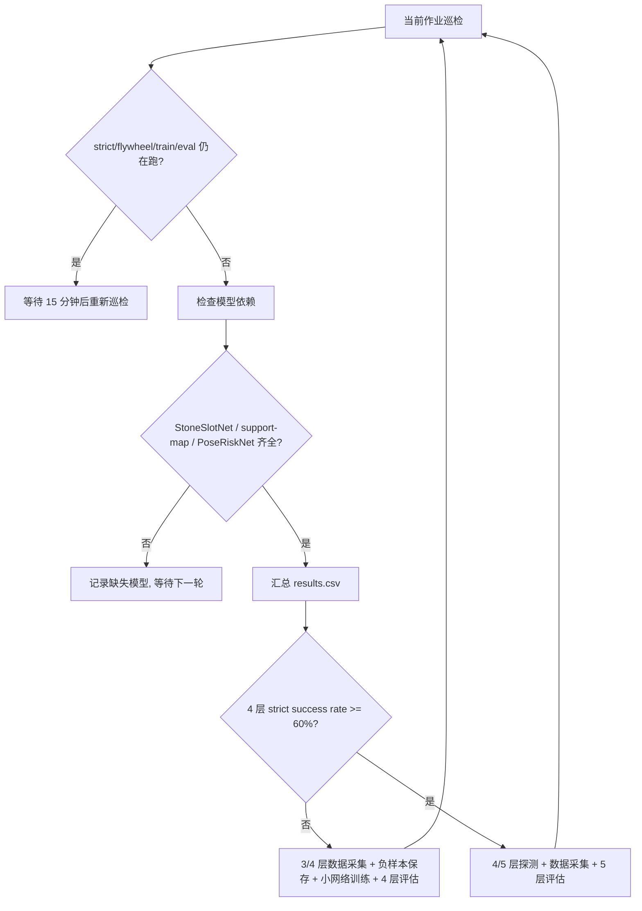

# 2026-06-22 自治石墙数据飞轮 master v2 记录

## 实验目的

当前目标不是直接随机冲击 10 层，而是让 3/4 层单面墙进入自动数据飞轮：

- 自动等待当前仿真、采样、训练、评估作业结束。
- 自动检查神经网络运行时文件是否齐全。
- 自动根据 4 层 strict success rate 决定继续补 4 层数据，还是进入 5 层探测。
- 自动把失败案例、near-miss、hard negative 和成功案例继续沉淀为训练数据。
- 严格追加保存，不删除、不覆盖历史实验。

## 为什么从 master v1 改成 v2

master v1 的默认升层门槛是 4 层 strict success rate >= 25%。当前观察结果里已经出现 4 层 strict `1/3`，这说明有阶段性成功，但还不能说明 4 层稳定。

因此 v2 把升 5 层门槛改为：

- 4 层 strict success rate >= 60% 才进入 `single_face_wall_5course_v1`。
- 低于 60% 时继续运行 `four_course_improve`：补 3/4 层数据、训练小网络、评估 4 层。

这个策略更符合“先稳定突破 4 层，再进入 5 层”的实验目标。

## 自动闭环结构

## 当前运行配置

- master job: `D:\MoonStack\experiments\moon_rock_stack\batch_runs\async_jobs\20260622_231000_cmd_autonomous_wall_flywheel_master_v2`
- scheduler state: `D:\MoonStack\experiments\moon_rock_stack\batch_runs\auto_wall_scale\20260622_autonomous_wall_flywheel_master_v2`
- manifest: `D:\MoonStack\experiments\moon_rock_stack\batch_runs\auto_wall_scale\20260622_autonomous_wall_flywheel_master_v2\manifest.json`
- ledger: `D:\MoonStack\experiments\moon_rock_stack\batch_runs\auto_wall_scale\20260622_autonomous_wall_flywheel_master_v2\LEDGER.md`
- 巡检周期：96 次，每次间隔 900 秒，约 24 小时。
- 当前升层门槛：`--four-success-threshold 0.60`。
- 4 层网络参与范围：`ranker_max_course=3`，即网络参与到第 4 层 cap 的候选筛选。
- 当前策略：StoneSlotNet + support-map CNN candidate ranker + PoseRiskNet。

## 第一轮巡检结果

v2 第一轮没有发新作业，而是正确进入等待状态：

- 当前阶段：`four_course_improve`。
- 当前观测 4 层 strict：`1/3`。
- 当前观测 4 层 shape：`1/3`。
- 当前 4 层平均可见层数：`3.0`。
- 当前 4 层平均高度：约 `0.281 m`。
- 当前 4 层平均水平漂移：约 `0.165 m`。
- 当前活跃外部作业数：`4`。

等待中的外部作业：

- `20260622_221000_cmd_auto_strict_4course`
- `20260622_221000_cmd_auto_flywheel_3to4`
- `20260622_224800_cmd_poserisk_v18b_train_eval4`
- `20260622_225000_cmd_supportmap_v19_train_eval4`

## 模型依赖门控

`scripts/auto_wall_scale_scheduler.py` 已新增 `--wait-for-model-dirs`。

该门控会在启动下一轮作业前检查：

- StoneSlotNet：`stone_fit_net.npz` + `stone_fit_net_schema.json`
- support-map CNN：`support_map_cnn_ranker.pt` + `schema.json`
- 或 candidate-pose ranker：`candidate_pose_rank_net.npz` + `candidate_pose_rank_net_schema.json`
- PoseRiskNet：`pose_risk_net.npz` + `pose_risk_net_schema.json`

如果模型文件缺失，调度器只会把缺失项写入 manifest/ledger，然后等待下一轮巡检，不会启动必然失败的仿真。

## 当前判断

已有 4 层成功样例说明方向有效，但 `1/3` 还不是稳定成功率。下一阶段优先级是：

1. 继续让当前 strict/flywheel/support-map 作业跑完。
2. 等 support-map v19 模型产出后，由 v2 master 自动发下一轮 4 层改进任务。
3. 扩大 3/4 层正负样本，训练更强的局部候选落点 ranker 和风险模型。
4. 当累计 4 层 strict success rate >= 60% 后，再自动进入 5 层探测。

