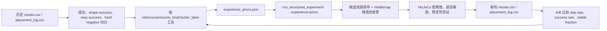

# 历史成功经验学习记录 2026-06-27

本轮目标不是继续盲目增加高度，而是从已有单面墙实验中抽取可复用经验，并把经验转成下一轮可控、可统计、可关闭的弱先验。先验只进入候选池排序，不作为神经网络输入特征直接喂给模型，避免把“历史成功率”当成石头自身几何属性。

## 数据来源

- 扫描目录：`D:\MoonStack\experiments\moon_rock_stack\batch_runs`
- 输出目录：`D:\MoonStack\experiments\moon_rock_stack\batch_runs\20260627_success_experience_v1`
- 分析脚本：`D:\MoonStack\experiments\moon_rock_stack\scripts\analyze_success_experience.py`
- 核心输出：
  - `README.md`：中文可读总结。
  - `case_summary_by_task.csv`：按 target/gravity 的成功率与稳定性。
  - `role_experience.csv`：成功/近成功 placement 的 role/course/source_kind 统计。
  - `skip_by_role.csv`：第 4 层 skipped slot 瓶颈。
  - `experience_priors.json`：可供下一轮实验使用的角色级 source_kind/cluster_label 弱先验。

## 样本规模

- `results.csv` 总样本：542 条。
- strict success：55 条。
- shape success：68 条。
- 3 层 strict success：46 条。
- 4 层 strict success：4 条。
- 4 层 near-success：217 条。

当前第 4 层严格成功仍然太少，直接训练强策略容易过拟合；更可靠的数据来源是 3 层 strict success + 4 层 near-success + 4 层 hard negative。

## 当前成功率

| 任务 | 重力 | trials | strict success | shape success | strict rate | shape rate |
|---|---|---:|---:|---:|---:|---:|
| `single_face_wall_3course_v1` | moon | 117 | 45 | 53 | 38.46% | 45.30% |
| `single_face_wall_4course_v1` | moon | 225 | 3 | 5 | 1.33% | 2.22% |
| `single_face_wall_4course_v1` | earth | 44 | 1 | 1 | 2.27% | 2.27% |
| `single_face_wall_2course_v1` | earth | 40 | 4 | 4 | 10.00% | 10.00% |
| `single_face_wall_2course_v1` | moon | 42 | 1 | 2 | 2.38% | 4.76% |

解释：3 层月面已经有可学习的正样本基础；4 层不是没有达到过，而是严格成功率很低，主要受 skipped slot、失败石头数和漂移共同影响。

## 关键瓶颈

第 4 层主要瓶颈不是 base，而是中高层候选位姿不可行。

| target | gravity | role | course | skipped/rows | skip rate | 主因 |
|---|---|---|---:|---:|---:|---|
| `single_face_wall_4course_v1` | moon | cap | 3 | 570/1125 | 50.67% | `no_feasible_pose` |
| `single_face_wall_4course_v1` | earth | cap | 3 | 105/220 | 47.73% | `no_feasible_pose` |
| `single_face_wall_4course_v1` | moon | middle | 2 | 470/1350 | 34.81% | `no_feasible_pose` |
| `single_face_wall_4course_v1` | earth | middle | 2 | 93/264 | 35.23% | `no_feasible_pose` |

结论：下一轮应优先降低 course-2 middle 和 course-3 cap 的 `no_feasible_pose`，而不是继续单独优化底层。底层月面 skip rate 只有约 5.40%，不是第 4 层失败的主矛盾。

## 学到的角色先验

从成功/近成功 placement 中抽取到的弱先验：

- base：`interlock_block_clast`、`bearing_block_clast`、`compact_block_clast` 更常见；稳定成功 placement 的平均支撑 overlap 接近 1.0，扰动约 0.00084 m。
- middle：`course_block_clast`、`tie_bridge_clast`、`buttress_clast`、`bearing_block_clast` 更常见；平均支撑 contact 接近 2，支撑 overlap 约 0.68。
- cap：`bearing_block_clast`、`tie_bridge_clast`、`buttress_clast`、`cap_block_clast` 更常见；平均支撑 contact 约 3.47，支撑 overlap 约 0.88。

这不是说其它石头不能用，而是下一轮候选池排序可以把这些类别作为弱偏置，同时仍保留 MuJoCo 可行性筛选、低释放搜索、PoseRisk 和稳定性判定。

## 已接入的可执行接口

新增命令行参数：

```powershell
C:\Users\all\miniconda3\envs\moon-rock-stack\python.exe -m moon_rock_stack.run_structured_experiment `
  --experience-priors batch_runs\20260627_success_experience_v1\experience_priors.json
```

接入方式：

- `experience_priors.json` 由 `scripts/analyze_success_experience.py` 从历史成功/近成功数据生成。
- `moon_rock_stack\run_structured_experiment.py` 读取该 JSON，并把它传入每个 MuJoCo task。
- `moon_rock_stack\structured.py` 在 `_literature_stone_pool()` 中使用弱先验：
  - 对 wall online strategy 生效。
  - 对 middle/cap 适度放宽候选池。
  - 对匹配历史经验的 source_kind/cluster_label 给负分，即更优排序。
  - 不绕过物理可行性，不直接决定最终放置。
- `placement_log.csv` 新增字段：
  - `experience_prior_enabled`
  - `experience_prior_score`
  - `experience_prior_source_weight`
  - `experience_prior_cluster_weight`

## 验证

已运行小规模 smoke case：

```powershell
C:\Users\all\miniconda3\envs\moon-rock-stack\python.exe -m moon_rock_stack.run_structured_experiment `
  --rocks 16 `
  --rock-profile wall_statics `
  --clusters 6 `
  --trials 1 `
  --targets single_face_wall_2course_v1 `
  --strategies statics_wall `
  --gravities moon `
  --candidates 2 `
  --steps-per-rock 12 `
  --hold-steps 24 `
  --workers 1 `
  --seed 27001 `
  --experience-priors batch_runs\20260627_success_experience_v1\experience_priors.json `
  --output batch_runs\20260627_experience_prior_smoke_v1
```

结果：命令正常完成，`results.csv` 中 `experience_prior_requested=1`，`placement_log.csv` 中先验分数字段正常写入。

## 下一轮实验假设

1. 使用经验先验后，4 层 wall 的 course-2 middle 和 course-3 cap skip rate 应下降。
2. 如果 skip rate 下降但 failure_count 上升，说明候选变多但物理扰动仍不可控，需要提高 PoseRisk 或低释放筛选权重。
3. 如果 skip rate 下降且 stable_fraction 上升，则说明角色级 source_kind/cluster_label 先验有效，可以进一步训练成小网络或作为 loss/采样权重。
4. 如果没有提升，需要回看 `experience_prior_score` 与最终成功/失败的相关性，避免错误经验被强化。

## 数据流



