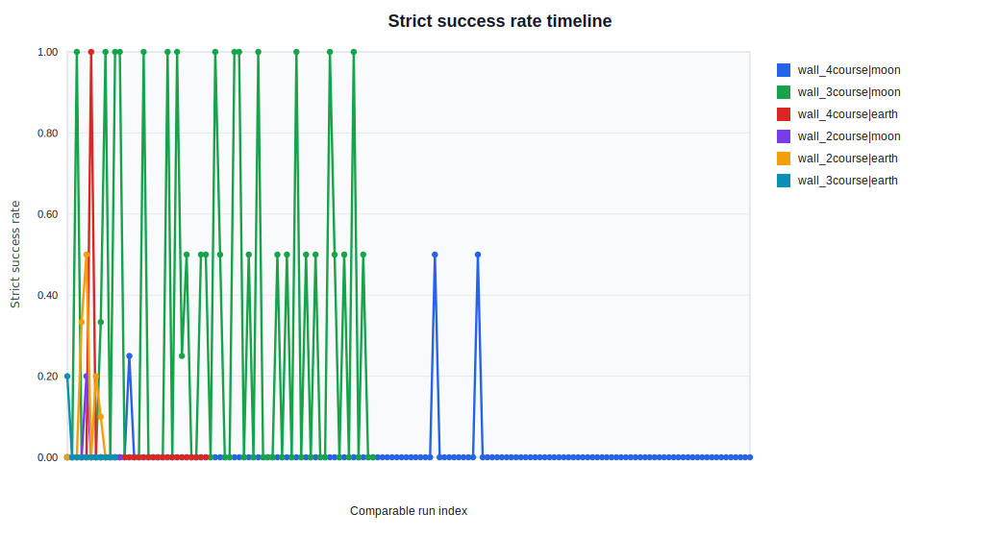
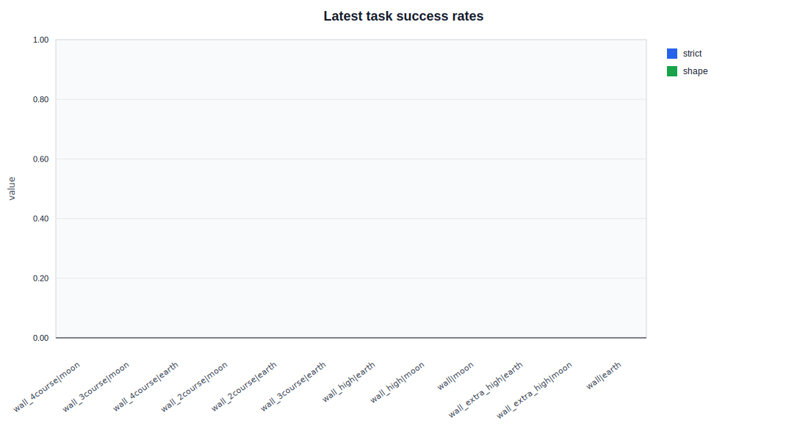
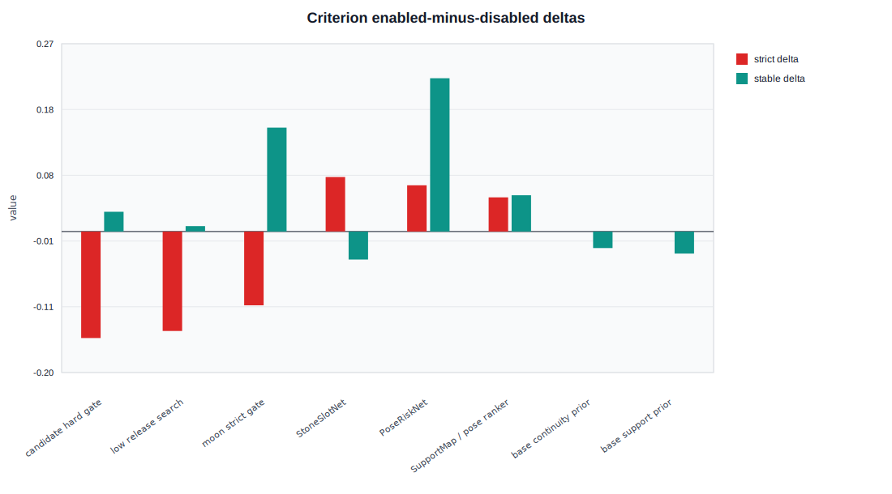
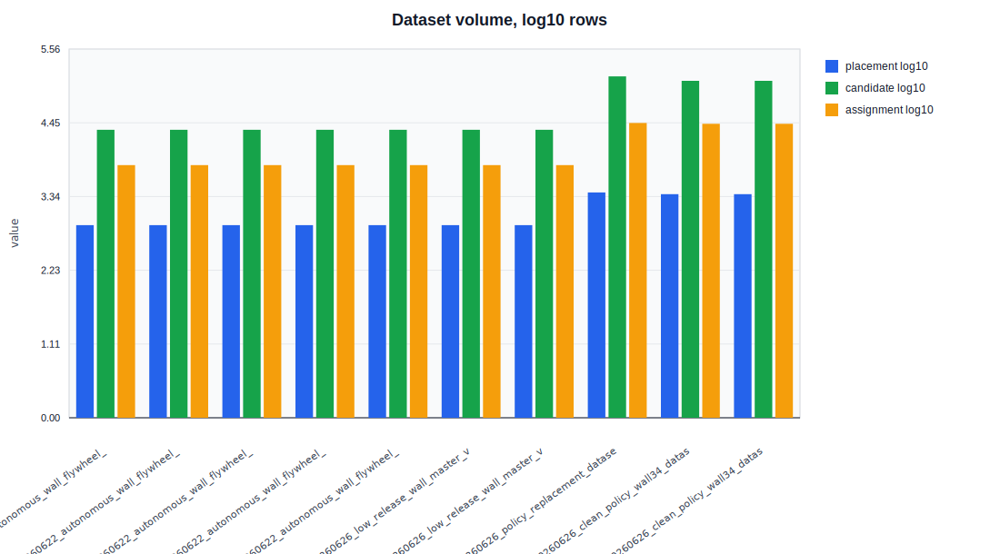
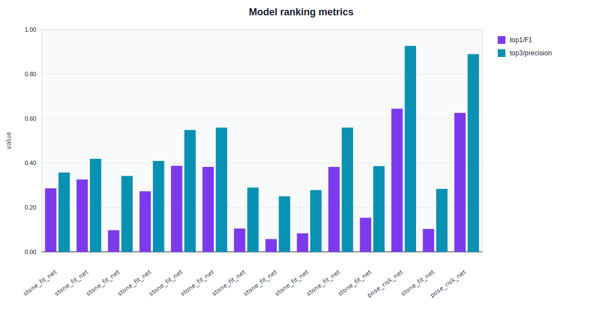

# 石头堆叠数据流与效果增长报告

- generated_at: `2026-06-26T21:42:14`
- batch_root: `D:\MoonStack\experiments\moon_rock_stack\batch_runs`
- report_dir: `D:\MoonStack\experiments\moon_rock_stack\docs\progress_reports\20260626_dataflow_growth_report_v3`
- target_filter: `single_face_wall`

## 一眼判断

- 4 层月面最新 strict success rate: `0.000`，shape: `0.000`，stable: `0.417`。
- 有 `4` 个任务被自动标记为疑似瓶颈，需要看 `task_growth.csv`。
- 观察性统计中 strict success 差值最大的判别标准是 `StoneSlotNet`，enabled-disabled = `0.079`。
- 最新可读模型指标来自 `pose_risk_net`，训练行数 `121679`，test F1 `0.801`。

## 本报告产物

- `success_by_run.csv`: 每个 run / target / gravity 的成功率、稳定比例、漂移和网络启用情况。
- `task_growth.csv`: 每个任务的最新成功率、相对上一可比 run 的增长率、瓶颈提示。
- `criterion_effectiveness.csv`: 每个判别标准启用/未启用的统计对照。
- `dataset_flow.csv`: 数据集来源、清洗后样本量和剔除量。
- `model_metrics.csv`: 各网络训练样本量、测试指标、top-k 指标。
- `figures/`: 自动生成的折线图和柱状图。

## 数据流动

| 阶段 | 名称 | 输入/来源 | 输出规模 | 用途 |
|---|---|---|---:|---|
| dataset | `20260622_autonomous_wall_flywheel_master_v2_c21_flywheel_3to4_learning_dataset` | `raw experiment logs` | placement=807, candidate=22167, assignment=6498 | training / analysis |
| dataset | `20260622_autonomous_wall_flywheel_master_v2_c23_flywheel_3to4_learning_dataset` | `raw experiment logs` | placement=807, candidate=22167, assignment=6498 | training / analysis |
| dataset | `20260622_autonomous_wall_flywheel_master_v2_c24_flywheel_3to4_learning_dataset` | `raw experiment logs` | placement=807, candidate=22167, assignment=6498 | training / analysis |
| dataset | `20260626_low_release_wall_master_v1_c03_flywheel_3to4_learning_dataset` | `raw experiment logs` | placement=807, candidate=22167, assignment=6498 | training / analysis |
| dataset | `20260626_low_release_wall_master_v1_c04_flywheel_3to4_learning_dataset` | `raw experiment logs` | placement=807, candidate=22167, assignment=6498 | training / analysis |
| dataset | `20260626_policy_replacement_dataset_v1` | `raw experiment logs` | placement=2515, candidate=141988, assignment=28075 | training / analysis |
| dataset | `20260626_clean_policy_wall34_dataset_v1` | `D:\MoonStack\experiments\moon_rock_stack\batch_runs\20260626_policy_replacement_dataset_v1` | placement=2364, candidate=121679, assignment=27322 | training / analysis |
| dataset | `20260626_clean_policy_wall34_dataset_v1` | `D:\MoonStack\experiments\moon_rock_stack\batch_runs\20260626_policy_replacement_dataset_v1` | placement=2364, candidate=121679, assignment=27322 | training / analysis |
| model | `20260622_autonomous_wall_flywheel_master_v2_c24_flywheel_3to4_pose_ranker_structure` | `D:\MoonStack\experiments\moon_rock_stack\batch_runs\20260622_autonomous_wall_flywheel_master_v2_c24_flywheel_3to4_pose_ranker_structure\metrics.json` | rows=2644, epochs=70 | ranking / risk / critic |
| model | `20260622_autonomous_wall_flywheel_master_v2_c24_flywheel_3to4_wall_state_critic` | `D:\MoonStack\experiments\moon_rock_stack\batch_runs\20260622_autonomous_wall_flywheel_master_v2_c24_flywheel_3to4_wall_state_critic\metrics.json` | rows=, epochs=70 | ranking / risk / critic |
| model | `stone_fit_net` | `D:\MoonStack\experiments\moon_rock_stack\batch_runs\20260626_low_release_wall_master_v1_c03_flywheel_3to4_learning_dataset` | rows=6498, epochs=80 | ranking / risk / critic |
| model | `20260626_low_release_wall_master_v1_c03_flywheel_3to4_pose_ranker_structure` | `D:\MoonStack\experiments\moon_rock_stack\batch_runs\20260626_low_release_wall_master_v1_c03_flywheel_3to4_pose_ranker_structure\metrics.json` | rows=2574, epochs=70 | ranking / risk / critic |
| model | `20260626_low_release_wall_master_v1_c03_flywheel_3to4_wall_state_critic` | `D:\MoonStack\experiments\moon_rock_stack\batch_runs\20260626_low_release_wall_master_v1_c03_flywheel_3to4_wall_state_critic\metrics.json` | rows=, epochs=70 | ranking / risk / critic |
| model | `stone_fit_net` | `D:\MoonStack\experiments\moon_rock_stack\batch_runs\20260626_low_release_wall_master_v1_c04_flywheel_3to4_learning_dataset` | rows=6498, epochs=80 | ranking / risk / critic |
| model | `20260626_low_release_wall_master_v1_c04_flywheel_3to4_pose_ranker_structure` | `D:\MoonStack\experiments\moon_rock_stack\batch_runs\20260626_low_release_wall_master_v1_c04_flywheel_3to4_pose_ranker_structure\metrics.json` | rows=2539, epochs=70 | ranking / risk / critic |
| model | `20260626_low_release_wall_master_v1_c04_flywheel_3to4_wall_state_critic` | `D:\MoonStack\experiments\moon_rock_stack\batch_runs\20260626_low_release_wall_master_v1_c04_flywheel_3to4_wall_state_critic\metrics.json` | rows=, epochs=70 | ranking / risk / critic |
| model | `stone_fit_net` | `D:\MoonStack\experiments\moon_rock_stack\batch_runs\20260626_policy_replacement_dataset_v1` | rows=28075, epochs=180 | ranking / risk / critic |
| model | `pose_risk_net` | `D:\MoonStack\experiments\moon_rock_stack\batch_runs\20260626_policy_replacement_dataset_v1` | rows=141988, epochs=160 | ranking / risk / critic |
| model | `stone_fit_net` | `D:\MoonStack\experiments\moon_rock_stack\batch_runs\20260626_clean_policy_wall34_dataset_v1` | rows=27322, epochs=220 | ranking / risk / critic |
| model | `pose_risk_net` | `D:\MoonStack\experiments\moon_rock_stack\batch_runs\20260626_clean_policy_wall34_dataset_v1` | rows=121679, epochs=180 | ranking / risk / critic |

## 任务成功率与增长率

| 任务 | runs | trials | 最新 run | strict | shape | stable | vs previous strict | 瓶颈提示 |
|---|---:|---:|---|---:|---:|---:|---:|---|
| `single_face_wall_4course_v1|moon` | 144 | 212 | `20260626_low_release_wall_master_v1_c04_flywheel_3to4_collect_exploit_00_seed206244636` | 0.000 | 0.000 | 0.417 | 0.000 | still_moving |
| `single_face_wall_3course_v1|moon` | 65 | 109 | `20260626_low_release_wall_master_v1_c04_flywheel_3to4_closed_loop_eval` | 0.000 | 0.000 | 0.810 | 0.000 | shape_metric_or_drift_bottleneck |
| `single_face_wall_4course_v1|earth` | 30 | 44 | `20260621_4course_earth_supportv4_stonefit_poseriskv5_w035_medium_after_mlpfix` | 0.000 | 0.000 | 0.625 | 0.000 | still_moving |
| `single_face_wall_2course_v1|moon` | 12 | 42 | `20260625_low_release_smoke_2course_moon` | 0.000 | 0.000 | 1.000 | 0.000 | shape_metric_or_drift_bottleneck |
| `single_face_wall_2course_v1|earth` | 9 | 40 | `20260620_curriculum_2course_assignment_neural_top4_seed95003_v1` | 0.000 | 0.000 | 0.907 | -0.100 | shape_metric_or_drift_bottleneck |
| `single_face_wall_3course_v1|earth` | 11 | 24 | `20260621_wall_flywheel_3course_pose_risk_w035_eval` | 0.000 | 0.000 | 0.871 | 0.000 | shape_metric_or_drift_bottleneck |
| `single_face_wall_high_v1|earth` | 16 | 16 | `20260619_newrocks_screening_seed93015_fullcandidates_highonly_parallel_v1` | 0.000 | 0.000 | 0.667 | 0.000 | still_moving |
| `single_face_wall_high_v1|moon` | 16 | 16 | `20260621_high_wall_8course_curriculum_oldstone_newrisk_v1` | 0.000 | 0.000 | 0.677 | 0.000 | still_moving |
| `single_face_wall_v1|moon` | 12 | 12 | `20260621_course3net_upperheuristic_4to5_moon_candidates5_seed602_v1` | 0.000 | 0.000 | 0.710 | 0.000 | still_moving |
| `single_face_wall_extra_high_v1|earth` | 2 | 2 | `20260620_closed_loop_extra_highwall_seed94016_risk_adjusted_top3_v1` | 0.000 | 0.000 | 0.533 | 0.000 | insufficient_history |
| `single_face_wall_extra_high_v1|moon` | 2 | 2 | `20260620_closed_loop_extra_highwall_seed94016_risk_adjusted_top3_v1` | 0.000 | 0.000 | 0.500 | 0.000 | insufficient_history |
| `single_face_wall_v1|earth` | 2 | 2 | `20260617_single_face_wall_v2_wall_blocks_smoke` | 0.000 | 0.000 | 0.812 | 0.000 | insufficient_history |

## 判别标准统计对照

下面的启用/未启用差值是观察性统计，不是严格因果证明。严格因果需要后续同 seed、同目标、同数据的 A/B。

| 判别标准 | enabled trials | disabled trials | strict 差值 | shape 差值 | stable 差值 | 解释 |
|---|---:|---:|---:|---:|---:|---|
| `candidate hard gate` | 4 | 175 | -0.154 | -0.189 | 0.029 | possibly_harmful_observational |
| `low release search` | 23 | 16 | -0.144 | -0.101 | 0.008 | possibly_harmful_observational |
| `moon strict gate` | 31 | 468 | -0.107 | -0.132 | 0.151 | stability_only_gain |
| `StoneSlotNet` | 316 | 177 | 0.079 | 0.099 | -0.041 | mixed_or_unclear |
| `PoseRiskNet` | 278 | 13 | 0.067 | 0.096 | 0.222 | promising_observational |
| `SupportMap / pose ranker` | 428 | 69 | 0.050 | 0.078 | 0.053 | mixed_or_unclear |
| `base continuity prior` | 3 | 6 | 0.000 | -0.167 | -0.024 | mixed_or_unclear |
| `base support prior` | 4 | 7 | 0.000 | -0.143 | -0.032 | mixed_or_unclear |

## 网络训练与参与程度

| 模型 | rows | epochs | test F1 | top1 | top3 | 数据集 |
|---|---:|---:|---:|---:|---:|---|
| `stone_fit_net` | 6498 | 80 | 0.211 | 0.382 | 0.559 | `20260622_autonomous_wall_flywheel_master_v2_c21_flywheel_3to4_learning_dataset` |
| `20260622_autonomous_wall_flywheel_master_v2_c21_flywheel_3to4_pose_ranker_structure` | 2669 | 70 |  | 0.000 | 0.000 | `` |
| `20260622_autonomous_wall_flywheel_master_v2_c21_flywheel_3to4_wall_state_critic` |  | 70 |  | 0.000 | 0.000 | `` |
| `20260625_supportmap_c20_c21_recent_courseweighted_train` | 5248 | 35 |  | 0.000 | 0.000 | `` |
| `stone_fit_net` | 6498 | 80 | 0.133 | 0.105 | 0.289 | `20260622_autonomous_wall_flywheel_master_v2_c23_flywheel_3to4_learning_dataset` |
| `20260622_autonomous_wall_flywheel_master_v2_c23_flywheel_3to4_pose_ranker_structure` | 2734 | 70 |  | 0.000 | 0.000 | `` |
| `20260622_autonomous_wall_flywheel_master_v2_c23_flywheel_3to4_wall_state_critic` |  | 70 |  | 0.000 | 0.000 | `` |
| `stone_fit_net` | 6498 | 80 | 0.125 | 0.058 | 0.250 | `20260622_autonomous_wall_flywheel_master_v2_c24_flywheel_3to4_learning_dataset` |
| `20260622_autonomous_wall_flywheel_master_v2_c24_flywheel_3to4_pose_ranker_structure` | 2644 | 70 |  | 0.000 | 0.000 | `` |
| `20260622_autonomous_wall_flywheel_master_v2_c24_flywheel_3to4_wall_state_critic` |  | 70 |  | 0.000 | 0.000 | `` |
| `stone_fit_net` | 6498 | 80 | 0.118 | 0.083 | 0.278 | `20260626_low_release_wall_master_v1_c03_flywheel_3to4_learning_dataset` |
| `20260626_low_release_wall_master_v1_c03_flywheel_3to4_pose_ranker_structure` | 2574 | 70 |  | 0.000 | 0.000 | `` |
| `20260626_low_release_wall_master_v1_c03_flywheel_3to4_wall_state_critic` |  | 70 |  | 0.000 | 0.000 | `` |
| `stone_fit_net` | 6498 | 80 | 0.205 | 0.382 | 0.559 | `20260626_low_release_wall_master_v1_c04_flywheel_3to4_learning_dataset` |
| `20260626_low_release_wall_master_v1_c04_flywheel_3to4_pose_ranker_structure` | 2539 | 70 |  | 0.000 | 0.000 | `` |
| `20260626_low_release_wall_master_v1_c04_flywheel_3to4_wall_state_critic` |  | 70 |  | 0.000 | 0.000 | `` |
| `stone_fit_net` | 28075 | 180 | 0.141 | 0.153 | 0.386 | `20260626_policy_replacement_dataset_v1` |
| `pose_risk_net` | 141988 | 160 | 0.817 | 0.644 | 0.927 | `20260626_policy_replacement_dataset_v1` |
| `stone_fit_net` | 27322 | 220 | 0.127 | 0.103 | 0.284 | `20260626_clean_policy_wall34_dataset_v1` |
| `pose_risk_net` | 121679 | 180 | 0.801 | 0.625 | 0.890 | `20260626_clean_policy_wall34_dataset_v1` |

## 图表

## 瓶颈判断规则

- 如果最近 3 个可比 run 的 strict success 增长都小于 5 个百分点，并且 shape/stable 也不涨，视为疑似瓶颈。
- 如果 shape success 上升但 strict success 不升，优先检查释放高度、settling、漂移和残余速度。
- 如果 top3 指标高但 top1 指标低，说明网络能筛出候选池，但还不能单独决策第一名。
- 如果 StoneSlotNet 低而 SupportMap/WallCritic 高，说明石头选择必须结合墙体局部状态。
- 如果 base 成功率高但 middle/cap 低，说明主要问题是上层支撑、互锁和误差传播。

## 原始规模

- results rows: `521`
- run/task rows: `321`
- task groups: `12`
- model metric files: `197`
- dataset summaries: `66`
