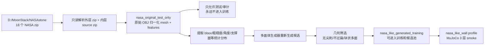

# NASA-like 月面石头迁移与 3 层墙 smoke 实验记录

时间：2026-06-27  
目标：按 `D:\MoonStack\NASAstone` 的要求，把 NASA 原始石头永久隔离为测试集，只用其几何统计分布生成相似但非同源的训练/仿真石头，并验证新石头分布能否进入现有神经网络辅助 dry stacking 流程。

## 1. 数据流与隔离规则



关键规则：

- 原始 NASA mesh、顶点、面片、纹理只在 `nasa_original_test_only/` 中使用，标记为 `TEST_ONLY_FOREVER_DO_NOT_TRAIN`。
- `nasa_like_generated_training/` 中的 mesh 是项目多面体生成器重新生成的，不复用 NASA 原始几何。
- NASA 原始样本不是主训练标准，只作为月面/陨石形态泛化测试；主训练仍以角状、多面、非 slab 的结构石头为核心。

## 2. 新增代码与数据目录

新增脚本：

- `D:\MoonStack\experiments\moon_rock_stack\scripts\build_nasa_like_rock_catalog.py`

生成器新增 profile：

- `nasa_like_wall`，位置：`D:\MoonStack\experiments\moon_rock_stack\moon_rock_stack\fractal_rocks.py`
- 该 profile 保留 `bearing_block_clast`、`course_block_clast`、`compact_block_clast`、`wall_block_clast`、`interlock_block_clast` 等现有结构语义，避免新 source_kind 无法被已有启发式和网络特征解释。

主要输出：

- `D:\MoonStack\experiments\moon_rock_stack\batch_runs\20260627_nasa_reference_polyhedral_v2`
- `D:\MoonStack\experiments\moon_rock_stack\batch_runs\20260627_nasa_like_wall_screen_v1`
- `D:\MoonStack\experiments\moon_rock_stack\batch_runs\20260627_nasa_like_wall_smoke_v1`

注意：`20260627_nasa_reference_polyhedral_v1` 和 `20260627_nasa_like_wall_eval_v1` 是中途诊断/半成品目录，未删除，后续不要作为正式统计源。

## 3. NASA test-only 与 synthetic training 规模

NASA 原始数据检查：

- 外层 zip：18 个。
- 每个外层 zip 包含一个内层 source zip 和一张 JPEG 预览图。
- 每个内层 source zip 包含一个 OBJ、MTL、JPG、PDF。
- 已提取/归一化 test-only OBJ：18 个。

正式 NASA-like 训练目录：

- synthetic training OBJ：320 个。
- 原始 test-only OBJ：18 个。
- synthetic 筛选阈值：
  - `spike_score <= 0.160`
  - `flatness <= 1.620`
  - `short_to_mid >= 0.620`

synthetic source_kind 分布：

```json
{
  "angular_boulder_clast": 22,
  "bearing_block_clast": 36,
  "buttress_clast": 34,
  "cap_block_clast": 34,
  "compact_block_clast": 47,
  "course_block_clast": 30,
  "equant_clast": 39,
  "interlock_block_clast": 21,
  "subangular_block": 30,
  "wall_block_clast": 27
}
```

几何分布摘要：

- NASA reference mean volume：`0.000909 m^3`
- synthetic mean volume：`0.001475 m^3`
- NASA reference mean elongation：`1.2446`
- synthetic mean elongation：`1.0681`
- NASA reference mean flatness：`1.3171`
- synthetic mean flatness：`1.1168`
- synthetic 更偏“块状承重石”，这是有意设计：NASA 原始样本中有部分较扁/较长形态，但训练候选仍要服从 dry stacking 的结构先验，避免把不利于墙体承重的 slab 直接引入训练。

## 4. `nasa_like_wall` 目标筛选

筛选输出：

- `D:\MoonStack\experiments\moon_rock_stack\batch_runs\20260627_nasa_like_wall_screen_v1`

筛选参数：

- rocks：260
- target：`single_face_wall_4course_v1`
- profile：`nasa_like_wall`
- clusters：10

结果：

- 总候选：260
- 几何筛选接受：234
- 几何筛选拒绝：26
- 接受率：90.0%

4 层墙贪心分配 source_kind：

```json
{
  "angular_boulder_clast": 1,
  "bearing_block_clast": 3,
  "buttress_clast": 3,
  "cap_block_clast": 1,
  "compact_block_clast": 7,
  "course_block_clast": 6,
  "equant_clast": 2,
  "subangular_block": 1
}
```

解释：

- base 层仍主要选择 `bearing_block_clast`、`buttress_clast`、`subangular_block`。
- middle 层主要选择 `course_block_clast`、`compact_block_clast`。
- cap 层倾向选择 `compact_block_clast`、`cap_block_clast`、少量 `angular_boulder_clast`。
- 这说明新 profile 没有破坏已有角色语义，可以进入当前神经网络辅助堆叠流程。

## 5. 当前 c08 网络训练状态

本轮 c08 数据飞轮目录：

- `D:\MoonStack\experiments\moon_rock_stack\batch_runs\20260626_low_release_wall_master_v1_c08_flywheel_3to4`

数据集：

- run examples：34
- placement examples：807
- candidate pose examples：22,167
- assignment candidate examples：6,498

小网络指标：

| 网络 | 任务 | 数据量 | 测试指标 | 当前判断 |
|---|---:|---:|---:|---|
| StoneSlotNet | 石头-槽位几何匹配 | 6,498 rows | F1 `0.120`，top1 `0.130`，top3 `0.239` | 仍弱，只能做保守 top-k 辅助 |
| PoseRiskNet | 候选位姿安全/风险 | 22,167 rows | F1 `0.955`，top1 safe `0.272`，top3 safe `1.000` | 正样本偏多，top3 有用，top1 不可完全信任 |
| SupportMap PoseRanker | 深度/support map + 几何位姿排序 | 2,629 rows / 768 groups | test top1 `0.490`，top3 `1.000` | 当前最有价值，适合作为候选位姿排序器 |
| WallStateCritic | 当前墙体状态风险预测 | 2,629 rows | test top1 `0.391`，top3 `1.000` | 可作为后续失败预警和训练信号 |

结论：

- 当前神经网络不是完全替代启发式，而是替代最昂贵的候选排序部分。
- 有效顺序是：启发式生成物理可解释候选，网络按深度/support map 与几何特征排序，MuJoCo 再验证。
- 真正值得继续扩大的数据是 `candidate_pose_examples` 和带 top depth/support map 的候选组。

## 6. c08 闭环评估阶段性结果

闭环评估目录：

- `D:\MoonStack\experiments\moon_rock_stack\batch_runs\20260626_low_release_wall_master_v1_c08_flywheel_3to4_closed_loop_eval`

已经完成的 3 层墙：

| trial | strict success | shape success | stable | failure | RMSE m | max drift m | height m | 备注 |
|---:|---:|---:|---:|---:|---:|---:|---:|---|
| 0 | 0 | 0 | 12 | 1 | 0.1143 | 0.3138 | 0.1912 | 可见 3 层但漂移大 |
| 1 | 1 | 1 | 14 | 0 | 0.0209 | 0.0058 | 0.3063 | 高质量 3 层 strict success |

当前 3 层 strict success：`1/2 = 50%`。  
这不是最终统计，但说明 c08 最新模型已经能产生高质量 3 层正样本。

4 层墙状态：

- 同一评估正在运行 `single_face_wall_4course_v1`。
- 当前观察到已经进入 cap 层，slot20 附近仍在继续。
- 已出现 `no_feasible_pose`，说明 4 层瓶颈仍是上层可行位姿和漂移控制。
- 截至本记录写入时还没有最终 4 层 `results.csv` 行。

## 7. NASA-like 3 层 smoke 结果

实验目录：

- `D:\MoonStack\experiments\moon_rock_stack\batch_runs\20260627_nasa_like_wall_smoke_v1`

参数：

- target：`single_face_wall_3course_v1`
- gravity：moon，`1.624 m/s^2`
- rocks：90
- candidates：4
- candidate probe steps：20
- steps per rock：180
- hold steps：600
- 使用 c08 最新 StoneSlotNet / PoseRanker / PoseRiskNet

结果：

| 指标 | 数值 |
|---|---:|
| strict success | 0 |
| shape success | 1 |
| visible courses | 3 |
| stable count | 14 |
| failure count | 1 |
| skipped slots | 0 |
| target RMSE | `0.0684 m` |
| max target error | `0.2126 m` |
| stack height | `0.2895 m` |
| max horizontal drift | `0.2001 m` |
| velocity inf norm | `0.0686` |

失败详情：

- 失败石头：rock `73`
- slot：14
- course：2
- role：cap
- source_kind：`course_block_clast`
- cluster：`multi_facet_clast_3`
- failure_reason：`missed_target+post_hold_drift`
- target error：`0.2126 m`
- horizontal drift：`0.2001 m`
- spike_score：`0.1300`
- flatness：`1.0680`
- elongation：`1.1585`

解释：

- 这个样本不是“石头堆”，正视图能看到墙面结构，俯视 object depth 能看到墙线和 cap 漂移。
- strict failure 的主要原因不是石头几何明显非法，而是 cap 级别放置后漂移；这说明上层位姿需要更强的支撑面约束或 repair/chock 策略。
- NASA-like profile 可以进入 3 层墙结构，但在只用 4 个候选、短 settling 的 smoke 条件下还不能 strict success。

## 8. 图像证据

捕获目录：

- `D:\MoonStack\experiments\moon_rock_stack\batch_runs\20260627_nasa_like_wall_smoke_v1\captures_nasa_like_smoke_v1`

典型案例：

- `00_single_face_wall_3course_v1_failure_statics_wall_moon_trial_00`

关键图：

- 正视 RGB：`wall_front_rgb.png`
- 正视 depth：`wall_front_depth.png`
- 正视 object depth：`wall_front_object_depth.png`
- 俯视 depth：`wall_top_depth.png`
- 俯视 object depth：`wall_top_object_depth.png`

抽查结论：

- `wall_front_rgb.png` 有效，可见 3 层墙形态和上层漂移。
- `wall_top_object_depth.png` 有效，不是全黄/单色图，能区分石头深度和墙线偏移。

## 9. 当前经验与下一步

已经确认有效的规则：

- `low_release_search` 有必要，避免高处自由落体带来的冲击扰动。
- base 层需要更大、更宽、更块状的 `bearing/buttress/subangular` 类石头。
- top-k 网络排序比 top1 更可靠；当前 PoseRanker top3 强于 top1。
- 正视 RGB + 俯视 object depth 是判断“墙”还是“石堆”的必要证据。

暂时不够有效的部分：

- StoneSlotNet 单独筛石头仍弱，不能完全替代槽位启发式。
- PoseRiskNet 的安全标签正样本比例过高，top1 不足以直接接管位姿选择。
- NASA-like smoke 中 cap 漂移仍明显，说明上层支撑约束没有完全学到。

下一步建议：

- 继续让 c08 完成 4 层闭环评估，若 4 层失败，把 cap/middle 的 `no_feasible_pose` 和 `post_hold_drift` 做负样本重采样。
- 对 NASA-like profile 跑更完整的 3 层实验：候选数从 4 提到 8-10，settling 恢复到 c08 评估标准，目标是先达到 3 层 60% strict success。
- 把 `wall_top_object_depth` 和候选几何特征接入 PoseRanker 的下一版训练，减少仅靠单石几何导致的数据拟合风险。
- 上层 cap 建议加入 repair/chock 或 support-overlap hard gate，避免最后一块石头把整体结构推偏。

