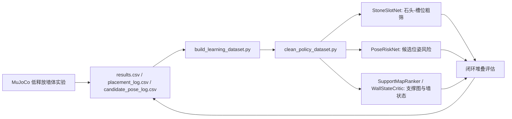

# 2026-06-27 月面 3/4 层石墙神经化阶段记录

## 实验目的

当前目标不是继续偶然堆高，而是先把 3/4 层单面墙的数据飞轮跑起来，用可解释的小网络逐步替代启发式搜索。核心判断标准是：

- 3 层墙需要稳定产生正样本，作为网络学习的下限任务。
- 4 层墙即使 strict 失败，也要保留 visible 4、低漂移、低 skipped 的近成功样本。
- 负样本不能丢，尤其是 middle/course=2 和 cap/course=3 的 `no_feasible_pose`、大漂移、扰动失败。
- 网络输入必须来自可观测先验：石头几何、候选位姿、重力、slot 角色、局部支撑/深度图；不能把测试后的成功率当输入。

## 当前数据流

## 新增与修复

- 修复 `scripts/clean_policy_dataset.py` 的过滤参数解析：之前 `--gravity moon` 会和默认 `earth,moon` 叠加，导致 moon-only 数据集混入 Earth 样本；现在只有未显式传参时才使用默认集合。
- 重新生成真正的月面清洗集：
  - `D:\MoonStack\experiments\moon_rock_stack\batch_runs\20260627_clean_useful_c07_moon_wall34_nearsuccess_v3`
  - run: 14
  - placement: 280
  - candidate pose: 4597
  - assignment candidate: 6210
- 修复已提交并推送：`0e607ba Fix policy dataset filter overrides`。

## c07 飞轮结果

来源：

- `D:\MoonStack\experiments\moon_rock_stack\batch_runs\20260626_low_release_wall_master_v1_c07_flywheel_3to4`
- 闭环评估：`D:\MoonStack\experiments\moon_rock_stack\batch_runs\20260626_low_release_wall_master_v1_c07_flywheel_3to4_closed_loop_eval`

关键结果：

| target | trial | rock | skipped | stable | failure | strict | shape | visible | rmse_xy_m | max_drift_m | height_m |
|---|---:|---:|---:|---:|---:|---:|---:|---:|---:|---:|---:|
| 3course | 0 | 15 | 0 | 10 | 5 | 0 | 0 | 3 | 0.231 | 0.681 | 0.284 |
| 3course | 1 | 11 | 4 | 10 | 1 | 0 | 0 | 3 | 0.062 | 0.187 | 0.272 |
| 4course | 0 | 15 | 9 | 10 | 5 | 0 | 0 | 3 | 0.159 | 0.360 | 0.310 |
| 4course | 1 | 19 | 5 | 16 | 3 | 0 | 0 | 4 | 0.080 | 0.215 | 0.355 |

阶段判断：

- c07 的 4 层 trial1 是高价值近成功样本：visible 4，稳定 16 块，失败 3 块，漂移约 0.215 m。
- 仍未 strict 成功，说明当前难点不是能不能把石头放到第四层，而是 cap 层和 course=2 的局部支撑/扰动控制。

## 经验先验 A/B

强经验先验：

- 输出：`D:\MoonStack\experiments\moon_rock_stack\batch_runs\20260627_experience_prior_c07_4course_eval_v2`
- 结论：有害。它通过跳过困难 slot 降低 RMSE/漂移，但 visible 层数、稳定数和高度都下降，不能作为主要策略。

弱经验先验 0.25：

- 输出：`D:\MoonStack\experiments\moon_rock_stack\batch_runs\20260627_experience_prior_w025_c07_4course_eval_v1`
- A/B 报告：`D:\MoonStack\experiments\moon_rock_stack\batch_runs\20260627_experience_prior_w025_c07_ablation_compare_v1`

| metric | baseline | weak prior | delta |
|---|---:|---:|---:|
| strict_success_rate | 0.000 | 0.000 | 0.000 |
| shape_success_rate | 0.000 | 0.000 | 0.000 |
| mean_visible_courses | 4.000 | 4.000 | 0.000 |
| mean_stable_count | 15.500 | 9.500 | -6.000 |
| mean_failure_count | 4.500 | 9.000 | +4.500 |
| mean_skipped_slot_count | 4.000 | 5.500 | +1.500 |
| mean_rmse_xy_m | 0.155 | 0.221 | +0.066 |
| mean_max_drift_m | 0.462 | 0.506 | +0.044 |
| mean_stack_height_m | 0.402 | 0.300 | -0.103 |

结论：

- source_kind/cluster_label 经验先验不能直接替代状态观测。
- 如果继续使用，只能作为弱正则或 tie-breaker，并且必须被局部 support/depth/wall-state 条件化。

## v3 清洗集小网络

清洗集：

- `D:\MoonStack\experiments\moon_rock_stack\batch_runs\20260627_clean_useful_c07_moon_wall34_nearsuccess_v3`

StoneSlotNet：

- 输出：`D:\MoonStack\experiments\moon_rock_stack\batch_runs\20260627_clean_c07_moon_wall34_stone_slot_net_v1`
- 输入：course、target、石头几何、source_kind、cluster_label、role。
- 输出：该石头是否适合当前 slot 的选择概率。
- 测试结果：accuracy 0.564，precision 0.052，recall 0.489，F1 0.093，group top1 0.095，top3 0.190。
- 判断：单靠石头几何泛化不足，不能强替代启发式选石，只能作为弱候选粗筛或后续与 support-map 联合。

PoseRiskNet：

- 输出：`D:\MoonStack\experiments\moon_rock_stack\batch_runs\20260627_clean_c07_moon_wall34_pose_risk_net_v1`
- 输入：重力、course、target、候选位姿、石头几何、role/source_kind/cluster_label。
- 输出：候选位姿风险概率。
- 标签：candidate 自身的 target error、y error、扰动和速度阈值。
- 测试结果：accuracy 0.636，precision 0.642，recall 0.864，F1 0.736，group top1 safe 0.756，top3 safe 1.000。
- 判断：这是当前最有价值的网络模块，适合优先接入下一轮闭环，用于减少危险候选位姿。

## c08 正在运行

当前运行：

- `D:\MoonStack\experiments\moon_rock_stack\batch_runs\20260626_low_release_wall_master_v1_c08_strict_4course`

trial0 已完成：

| trial | rock | skipped | stable | failure | strict | shape | visible | rmse_xy_m | max_drift_m | height_m |
|---:|---:|---:|---:|---:|---:|---:|---:|---:|---:|---:|
| 0 | 18 | 6 | 14 | 4 | 0 | 0 | 4 | 0.119 | 0.274 | 0.263 |

初步判断：

- c08 trial0 visible 4，RMSE 和漂移比很多旧失败更低，但高度偏低，cap 层仍大量 `no_feasible_pose`。
- 如果 trial1 也保持 visible 4，应把 c08 数据纳入下一轮清洗集；如果 trial1 崩掉，要分析底层支撑与 cap 候选位姿的差异。

## 下一步

- 等 c08 trial1 完成后，统计 c08 strict 4 层成功率、visible 4 比率、cap skipped/failure 分布。
- 用 v3 PoseRiskNet 替换旧 PoseRiskNet 跑一轮小规模 4 层闭环，验证风险网络是否降低漂移和 cap 层失败。
- StoneSlotNet 暂不强接入；下一版应把 support/depth map 或当前墙状态加入选石输入，否则容易只拟合石头类别。
- 继续保留失败数据作为 hard negative，不删除任何原始输出。
