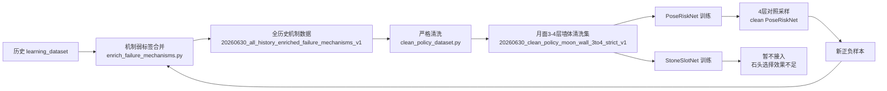

# 2026-06-30 数据清洗与4层推进更新

本轮目的不是继续盲目堆高，而是把已经收集到的3-4层墙体数据清洗成更可信的训练集，判断哪些网络真的有用，然后把有用网络接回4层采样。

## 当前结论

1. 全历史数据直接混训没有带来提升。全历史 StoneSlotNet 和 PoseRiskNet 都比近期/清洗数据的对照弱，说明历史数据里存在任务版本、石头生成版本、释放参数和早期失败策略混杂的问题。
2. StoneSlotNet 仍然是弱项。只用“石头几何 + 目标槽位 + 层级角色”去判断哪块石头适合某个槽位，跨 run 泛化很差。后续石头选择必须加入墙体观测，例如 top depth、support map、local height field 或点云上下文。
3. PoseRiskNet 更有阶段价值。干净3-4层月面墙数据训练出的 PoseRiskNet 在候选组 top3 safe rate 达到 0.9786，可以作为4层候选位姿风险过滤器继续使用。
4. 第4层当前主要困难不是单纯随机性，而是 `no_feasible_pose`、`upper_contact_too_few` 和释放扰动共同导致的结构失稳。
5. 后续策略：石头选择暂时保留旧的3层网络/启发式，位姿风险替换为干净3-4层 PoseRiskNet，并继续采集4层正负样本。

## 数据流

## 机制标签

新增后验机制标签包括：

- `mechanism_bottom_support_insufficient`
- `mechanism_upper_contact_too_few`
- `mechanism_release_disturbance_excessive`
- `mechanism_geometry_mismatch`
- `mechanism_neighbor_gap_too_large`
- `mechanism_target_miss`
- `mechanism_no_feasible_pose`
- `mechanism_post_hold_drift`
- `mechanism_low_or_fallen`
- `failure_mechanism_primary`

这些字段只能作为训练监督、统计诊断或未来辅助损失，不能作为推理输入。当前推理输入仍限制为放置前已知信息：重力、目标结构、层级/角色、石头几何、候选位姿和可用观测图。

## 全历史机制数据

路径：

`D:\MoonStack\experiments\moon_rock_stack\batch_runs\20260630_all_history_enriched_failure_mechanisms_v1`

规模：

- input datasets: 53
- run_examples: 763
- placement_examples: 10873
- candidate_pose_examples: 261095
- assignment_candidate_examples: 41354
- placement success: 7055
- placement negative: 3818

placement 主失败机制：

- `upper_contact_too_few`: 1974
- `no_feasible_pose`: 1354
- `bottom_support_insufficient`: 264
- `release_disturbance_excessive`: 124
- `target_miss`: 82
- `neighbor_gap_too_large`: 20

全历史数据的价值是覆盖面大，适合做诊断和机制挖掘；但直接用于策略网络训练会引入明显噪声。

## 严格清洗数据

路径：

`D:\MoonStack\experiments\moon_rock_stack\batch_runs\20260630_clean_policy_moon_wall_3to4_strict_v1`

清洗标准：

- target 只保留 `single_face_wall_3course_v1` 和 `single_face_wall_4course_v1`
- strategy 只保留 `statics_wall`
- gravity 只保留 `moon`
- role 只保留 `base/middle/cap`
- `target_error_xy_m <= 0.80`
- `abs(target_y_error_m) <= 0.35`
- `placed_disturbance_xy_m <= 0.50`
- `velocity_inf_norm_after_place <= 5.0`
- `rock_volume >= 0.00005`
- 必须有完整几何字段和候选位姿后验指标

清洗后规模：

- run_examples: 57
- placement_examples: 920
- candidate_pose_examples: 35779
- assignment_candidate_examples: 20109

4层 placement 负样本更集中：

- middle `no_feasible_pose`: 65
- middle `upper_contact_too_few`: 53
- cap `upper_contact_too_few`: 34
- cap `no_feasible_pose`: 33
- base `no_feasible_pose`: 31
- base `release_disturbance_excessive`: 10

这说明4层墙体的核心问题是上层可行位姿、接触点数量、下层支撑连续性和释放扰动，而不是单一规则可以解决。

## 网络对比

完整表格：

`D:\MoonStack\experiments\moon_rock_stack\docs\progress_reports\20260630_clean_policy_4course_update_v1\metrics_summary.csv`

关键结果：

| 模型 | 数据集 | 参数量 | 组级指标 | 决策 |
|---|---:|---:|---:|---|
| 3层 StoneSlotNet baseline | positive_mining_3course | 215041 | top1 0.2292 / top3 0.3750 | 暂时保留作石头粗筛 |
| recent PoseRiskNet | recent enriched wall | 473857 | top1 0.6273 / top3 0.8892 | 可用 |
| all-history StoneSlotNet | all-history enriched | 807937 | top1 0.1371 / top3 0.3091 | 不接入，历史噪声明显 |
| all-history PoseRiskNet | all-history enriched | 833537 | top1 0.5923 / top3 0.8641 | 不接入，历史噪声明显 |
| clean 3-4 StoneSlotNet | strict moon 3-4 wall | 471553 | top1 0.0853 / top3 0.2558 | 不接入，说明石头选择输入不足 |
| clean 3-4 PoseRiskNet | strict moon 3-4 wall | 485377 | top1 0.6579 / top3 0.9786 | 接入4层对照采样 |

## 当前4层对照实验

第一条4层线：

`D:\MoonStack\experiments\moon_rock_stack\batch_runs\async_jobs\20260630_cmd_fourcourse_lowrelease_deepmlp_probe_v1`

策略：

- 目标：`single_face_wall_4course_v1`
- 前3层使用旧 StoneSlotNet / PoseRanker / PoseRiskNet
- 第4层保留启发式兜底
- 低释放高度搜索开启

第二条4层线：

`D:\MoonStack\experiments\moon_rock_stack\batch_runs\async_jobs\20260630_cmd_fourcourse_clean_pose_risk_probe_v1`

策略：

- 目标：`single_face_wall_4course_v1`
- StoneSlotNet 仍使用旧3层版本，只作用到 course<=2
- PoseRanker 仍使用旧结构版本，只作用到 course<=2
- PoseRiskNet 替换为 `20260630_clean_policy_moon_wall_3to4_pose_risk_net_v1`
- clean PoseRiskNet 作用到全部层
- `pose-risk-weight = 0.50`

比较目标：

- 是否减少第4层 `release_disturbance_excessive`
- 是否减少第4层 `upper_contact_too_few`
- 是否提升4层 `shape_success`
- 是否提高稳定石头数量和墙体高度
- 是否降低 target RMSE 和横向漂移

## 当前调度

本机正在保留多条异步线：

- 3层 deep MLP exploit 采样
- 3层 success harvest 采样
- 4层旧 PoseRiskNet 探测采样
- 4层 clean PoseRiskNet 对照采样
- support/depth map 导出

当前策略是让数据飞轮继续转动：采样产生正负样本，样本进入机制标注和清洗，清洗数据再训练中间网络，只有指标变好的网络才接回采样。

## 下一步

1. 等两条4层采样线写出 `results.csv` 后，比较旧 PoseRiskNet 与 clean PoseRiskNet 的4层成功率和失败机制分布。
2. 如果 clean PoseRiskNet 的4层失败机制减少，下一轮把它作为默认4层风险过滤器。
3. StoneSlotNet 暂时不继续盲目加宽，改为设计“石头几何 + 墙体观测”的匹配网络。
4. 新4层数据完成后，重新运行机制标注和清洗，形成 `v2` 数据集。
5. 对成功样例补拍 RGB/top-depth/front/top 视角，失败典型案例单独留作负样本分析。
