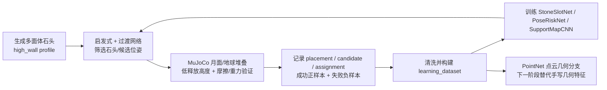

# 网络架构与数据飞轮说明

更新时间：2026-06-30

## 当前首要目标

当前首要目标不是盲目挑战更高层数，而是**加速制造更多成功数据**。原因很直接：3/4 层策略还没有足够稳定，如果继续把主要算力投入 5/6/10 层，会产生大量偶然失败，训练信号稀疏，难以判断网络是否真的学到了堆叠规律。

当前数据飞轮按以下顺序执行：



## 为什么保留原网络

原来的网络是必要的**过渡网络**，不是最终方案。

它的作用是先把人工启发式里的部分判断压缩成可学习打分器，让系统从“纯启发式搜索”过渡到“启发式 + 小网络排序”。在成功数据还不够多时，直接上大端到端模型风险很高：网络容易记住已有石头和任务分布，而不是学到真正的几何支撑规律。因此当前策略是：

- 保留原 MLP：作为稳定 baseline 和在线运行兼容模型。
- 加深加宽 MLP：提高表达能力，逐步替代启发式排序。
- 引入 PointNet：让网络直接从石头点云学习几何 embedding，减少手写几何标量的上限。
- 保留 support-map CNN：让网络看到当前墙面/堆叠状态，而不是只看单个石头外形。

## 当前正样本制造任务

新启动的高产正样本任务：

- job: `D:\MoonStack\experiments\moon_rock_stack\batch_runs\async_jobs\20260630_cmd_positive_mining_3course_moon_v1`
- flywheel session: `D:\MoonStack\experiments\moon_rock_stack\batch_runs\20260630_positive_mining_3course_moon_v1`
- 目标：`single_face_wall_3course_v1`
- 重力：月面 `1.624 m/s^2`
- 策略：`statics_wall`
- 模式：exploit，只使用当前最稳网络和先验
- 批次：4 个 collect exploit jobs，前 3 个并行，第 4 个排队
- 每批 trial：3
- 石头库：每批 260 个 high_wall 多面体石头
- 候选位姿：每个 slot/stone 最多 16 个候选
- 关键先验：低释放高度、底层大支撑石、底层连续性、PoseRiskNet 风险惩罚

选择这个任务的依据：

- 旧数据中 `single_face_wall_3course_v1 | moon | statics_wall` placement 成功率约 `0.829`。
- 4 层月面第 4 层 cap placement 成功率约 `0.284`，现在作为主采集目标效率过低。
- 先把 3 层成功样本做厚，再训练网络提升 3/4 层稳定性，之后再推 5 层以上更科学。

## 网络 1：StoneSlotNet

用途：在 pose search 前判断“某块石头是否适合某个墙体 slot/role”。这是第一个替代启发式 stone selection 的过渡网络。

输入：

- 已知的目标 slot 信息：`course, target_x, target_y`
- 已知 role：`base / middle / cap`
- 石头几何特征：体积、表面积、面数、bbox、elongation、flatness、sphericity、roughness、angularity、spike score、rectangularity、concavity proxy、主面数量、最大面比例、支撑面质量等
- 石头类别特征：`source_kind`, `cluster_label`
- 注意：不输入后验成功率，不输入测试后的统计成功率

输出：

- 一个标量概率：`P(stone fits slot before pose search)`
- 用于排序候选石头，减少随机试错

旧过渡网络：

- 输入维度：`98`
- 结构：`Linear(98,160) -> ReLU -> Dropout -> Linear(160,1) -> Sigmoid`
- 线性层数：`2`
- 参数量：`16,001`
- 当前 role-balanced 版本 top-k 指标：top1 约 `0.286`，top3 约 `0.508`

加深版本：

- 输入维度：`98`
- 默认结构：`Linear(98,512) -> SiLU -> Dropout -> Linear(512,256) -> SiLU -> Dropout -> Linear(256,128) -> SiLU -> Dropout -> Linear(128,1) -> Sigmoid`
- 线性层数：`4`
- 隐藏层：`[512, 256, 128]`
- 参数量：`215,041`
- 目的：在同样的已知几何先验输入上，提高石头-slot 匹配能力，先替代一部分启发式筛选。

## 网络 2：PoseRiskNet

用途：在 commit 石头前判断候选位姿的风险，减少会冲散墙体或漂移过大的放置。

输入：

- 已知重力：`gravity_m_s2`
- 目标 slot：`course, target_x, target_y`
- 候选位姿：`pose_x, pose_y, pose_z, pose_qw, pose_qx, pose_qy, pose_qz`
- 候选编号信息：`candidate_id, candidate_count`
- 石头几何与类别特征
- 注意：训练标签可来自候选 pose 的扰动/速度/误差，但推理输入不使用后验成功统计

输出：

- 一个标量概率：`P(candidate pose is safe)`
- 用于风险惩罚：`score = pose_ranker_score - lambda * risk_penalty`

旧过渡网络：

- 输入维度：`122`
- 结构：`Linear(122,192) -> ReLU -> Dropout -> Linear(192,1) -> Sigmoid`
- 线性层数：`2`
- 参数量：`23,809`
- 当前 v2 指标：top1 safe 约 `0.708`，top3 safe `1.000`

加深版本：

- 输入维度：`122`
- 默认结构：`Linear(122,640) -> SiLU -> Dropout -> Linear(640,320) -> SiLU -> Dropout -> Linear(320,160) -> SiLU -> Dropout -> Linear(160,1) -> Sigmoid`
- 线性层数：`4`
- 隐藏层：`[640, 320, 160]`
- 参数量：`335,361`
- 目的：从简单风险过滤升级为更强的候选位姿安全打分器。

## 网络 3：SupportMapCNNRanker

用途：让网络看到当前局部墙面状态，而不是只看石头外观。这是当前最接近“观测信息 + 自身石头信息 -> 放置位置评分”的模块。

输入：

- map 输入：`[10, 64, 64]`
- map channels：
  - front depth / valid
  - top depth / valid
  - top target gaussian
  - top candidate footprint
  - front target gaussian
  - front candidate silhouette
  - gravity ratio
  - course ratio
- numeric 输入维度：`82`
- numeric 内容：候选 pose、目标位置、石头几何、特征 present mask；未来可拼接 PointNet embedding

输出：

- 一个候选位姿 ranking score
- 在同一候选组内用 groupwise softmax / top-k 评价

当前结构：

- map encoder：
  - `Conv2d(10,32,k=5) -> BatchNorm -> SiLU -> MaxPool`
  - `Conv2d(32,64,k=3) -> BatchNorm -> SiLU -> MaxPool`
  - `Conv2d(64,128,k=3) -> BatchNorm -> SiLU -> AdaptiveAvgPool`
- numeric encoder：
  - `Linear(82,64) -> LayerNorm -> SiLU -> Dropout`
- fusion head：
  - `Linear(192,192) -> LayerNorm -> SiLU -> Dropout -> Linear(192,1)`
- 参数量：`143,905`
- 当前 holdout 指标：top1 约 `0.304`，top3 约 `0.904`
- 4 层月面 top3 约 `0.952`，说明它适合做候选缩小，但 top1 还不足以完全替代搜索。

## 网络 4：PointNetRockEncoder

用途：把石头几何从手写标量升级为点云 embedding。它不直接决定放置位置，而是提供更强的石头形状表征。

输入：

- 每块石头从 OBJ mesh 表面采样 `1024` 个点
- 每个点输入：`xyz + normal`
- 张量形状：`[1024, 6]`

输出：

- `256-D` rock embedding
- source-kind 分类 logits
- cluster-family 分类 logits

结构：

- xyz T-Net：学习输入点云 canonical alignment
- shared point MLP：`6 -> 64 -> 64 -> 128 -> 256`
- symmetric pooling：global max pooling
- source head：`Linear(256,256) -> ReLU -> Dropout -> Linear(256,11)`
- cluster head：`Linear(256,256) -> ReLU -> Dropout -> Linear(256,5)`
- 参数量：`985,753`

当前状态：

- CPU smoke test 已通过。
- CUDA 前台 1 epoch smoke test 已通过。
- 长时后台 CUDA 训练出现 native crash，返回码 `3228369023`，stderr 为空；这被记录为稳定性问题，不影响当前正样本采集优先级。

## 网络 5：PointNetRoleAffordance

用途：判断一块石头更适合作为 `base / middle / cap`。它用于提高石头选择质量，尤其解决底层用小石头导致上层支撑不足的问题。

输入：

- 同 PointNetRockEncoder：`[1024, 6]` 点云

输出：

- 3 个概率：`P(base), P(middle), P(cap)`

结构：

- xyz T-Net
- shared point MLP：`6 -> 64 -> 64 -> 128 -> 256`
- global max pooling
- role head：`Linear(256,384) -> LayerNorm -> SiLU -> Dropout -> Linear(384,3)`
- 参数量：`950,668`

当前 smoke test：

- CPU 2 epoch observed F1 约 `0.781`
- CUDA 1 epoch smoke test observed F1 约 `0.777`
- cap 类别仍弱，因为 cap 成功样本少，后续需要通过更多 3/4 层成功数据补足。

## 参数量公式

MLP 参数量：

```text
params = sum_i (d_i * d_{i+1} + d_{i+1})
```

其中 `d_i` 是第 `i` 层输入维度，`d_{i+1}` 是输出维度，偏置项为 `d_{i+1}`。

PointNet 核心表示：

```text
h_i = shared_mlp(T(x_i))
z = max_i h_i
y = head(z)
```

其中 `T` 是 T-Net 学到的对齐变换，`max_i` 是对点顺序不敏感的对称池化。

Support-map ranker：

```text
s = head(concat(CNN(map), MLP(numeric)))
P(candidate | group) = softmax(s_group)
```

## 下一步

1. 优先完成 `20260630_positive_mining_3course_moon_v1`，获取更多成功 placements。
2. 新 dataset 完成后，先训练加深 StoneSlotNet 和 PoseRiskNet，比较旧过渡网络与加深网络的 top1/top3 提升。
3. 如果 3 层正样本明显增加，继续做 4 层 moon 的 curriculum mining，而不是直接堆更高。
4. PointNet 暂时不阻塞数据采集；等正样本足够后，把 PointNet embedding 接入 support-map ranker 做离线 ablation。
